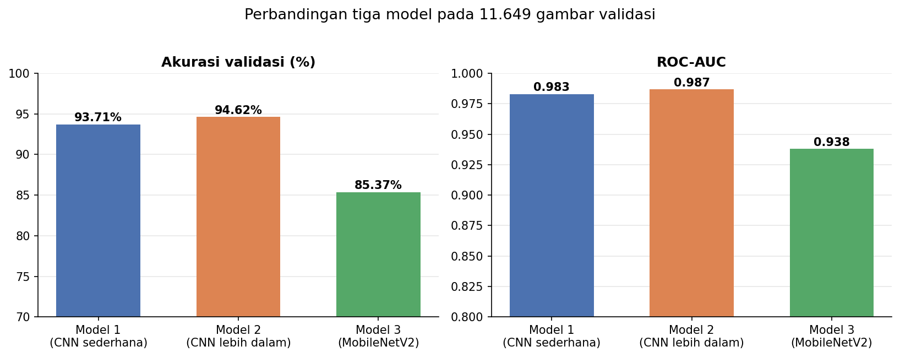
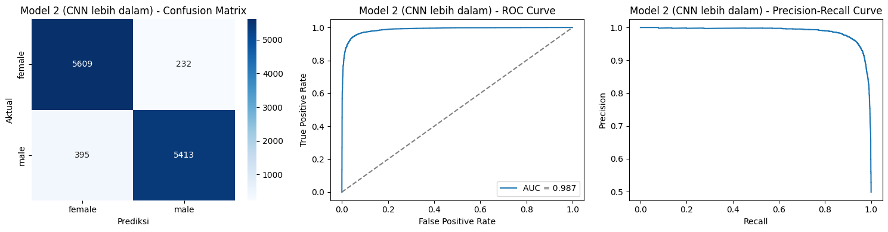
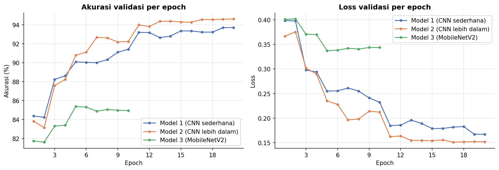
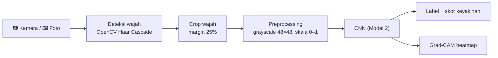
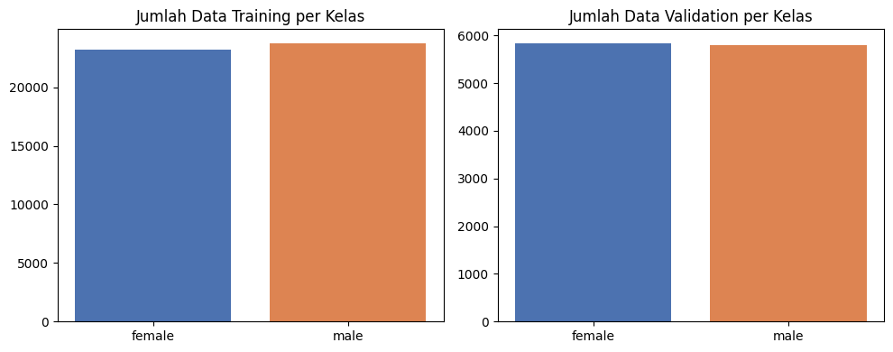

# Gender Detection dari Wajah — CNN + Kamera


> **English summary.** A face-based binary gender classifier built with TensorFlow/Keras. Three models are compared on the Kaggle *Gender Classification Dataset* (47,009 training / 11,649 validation images): two custom grayscale CNNs and a frozen-MobileNetV2 transfer-learning baseline. The best model (a small 2-conv-layer CNN, 1.7 M parameters) reaches **94.62 % validation accuracy** (ROC-AUC 0.987). The notebook also includes OpenCV face detection, Grad-CAM explanations, a webcam capture flow and a photo-upload widget. Everything runs on CPU.

## Ringkasan

Project ini melatih dan membandingkan tiga arsitektur *deep learning* untuk mengklasifikasikan gender (female / male) dari foto wajah, lalu membungkusnya menjadi alur yang bisa dipakai langsung: **ambil foto lewat kamera → deteksi wajah → prediksi + skor keyakinan → visualisasi Grad-CAM**.

Fitur utama:

- **Tiga model dibandingkan:** dua CNN kustom (grayscale 48×48) dan satu model *transfer learning* MobileNetV2 (RGB 96×96).
- **Augmentasi data** (rotasi, geser, zoom, shear, flip) dan **callback training** (`EarlyStopping`, `ReduceLROnPlateau`, `ModelCheckpoint`, `CSVLogger`).
- **Evaluasi lengkap:** classification report, confusion matrix, kurva ROC dan Precision-Recall.
- **Pemilihan model terbaik otomatis** berdasarkan akurasi validasi.
- **Deteksi wajah** dengan OpenCV Haar Cascade sebelum prediksi.
- **Grad-CAM** untuk melihat area wajah yang menjadi fokus model.
- **Tiga cara input:** kamera (jendela atau *countdown*), tombol upload foto (`ipywidgets`), dan prediksi batch dari folder dengan ekspor CSV.

## Hasil

Dievaluasi pada 11.649 gambar validasi (5.841 female, 5.808 male):

| Model | Input | Parameter (total / dilatih) | Akurasi | F1 (macro) | ROC-AUC |
|---|---|---|---|---|---|
| Model 1 — CNN sederhana | 48×48 grayscale | 428.545 / 428.545 | 93,71% | 0,94 | 0,983 |
| **Model 2 — CNN lebih dalam** | 48×48 grayscale | 1.713.153 / 1.713.153 | **94,62%** | **0,95** | **0,987** |
| Model 3 — MobileNetV2 (*frozen*) | 96×96 RGB | 2.340.033 / 82.049 | 85,37% | 0,85 | 0,938 |



Model 2 dipilih sebagai model terbaik. Confusion matrix-nya: 5.609 female dan 5.413 male terprediksi benar, dengan 232 female salah dibaca male dan 395 male salah dibaca female.



Kurva validasi ketiga model:



Evaluasi Model 1 dan Model 3 ada di [`assets/evaluation_model1.png`](assets/evaluation_model1.png) dan [`assets/evaluation_model3.png`](assets/evaluation_model3.png).

**Catatan pembacaan hasil**

- CNN kecil justru mengalahkan MobileNetV2. Dugaan penyebabnya (belum diuji): basis MobileNetV2 dibekukan sehingga fitur ImageNet tidak disesuaikan ke wajah, input hanya 96×96, dan gambar diskalakan ke 0–1 padahal MobileNetV2 berbobot ImageNet mengharapkan −1 hingga 1 (`preprocess_input`).
- Model 1 dan 2 masih membaik di epoch ke-20 (batas `EPOCHS`), jadi belum benar-benar konvergen.

## Cara kerja



Kalau tidak ada wajah terdeteksi, notebook memakai seluruh foto sebagai input **tanpa peringatan**, sehingga hasilnya kurang bisa dipercaya (lihat bagian keterbatasan).

## Dataset

[Gender Classification Dataset](https://www.kaggle.com/datasets/cashutosh/gender-classification-dataset) dari Kaggle (cashutosh): gambar wajah yang sudah dicrop, terbagi ke folder `Training` dan `Validation`.

| | Female | Male | Total |
|---|---|---|---|
| Training | 23.243 | 23.766 | 47.009 |
| Validation | 5.841 | 5.808 | 11.649 |

Dataset **tidak disertakan** di repo ini. Lisensi dan ketentuan penggunaannya mengikuti halaman dataset di Kaggle, jadi silakan dicek sebelum dipakai atau dibagikan ulang. Petunjuk penempatan ada di [`data/README.md`](data/README.md).



## Model dan pengaturan training

| | Model 1 | Model 2 | Model 3 |
|---|---|---|---|
| Arsitektur | Conv32 → Conv64 → Dense64 | Conv64 → Conv128 → Dense128 | MobileNetV2 (frozen) → GAP → Dense64 |
| Dropout | 0,5 | 0,5 | 0,3 (dua kali) |
| Optimizer | Adam (lr 1e-3) | Adam (lr 1e-3) | Adam (lr 1e-4) |
| Epoch berjalan | 20 | 20 | 10 (berhenti lebih awal) |

Pengaturan umum: *binary cross-entropy*, output sigmoid, batch 32, maksimum 20 epoch, dan dilatih di CPU. Augmentasi: rotasi 20°, geser lebar/tinggi 0,2, shear 0,2, zoom 0,2, *horizontal flip*. Callback: `EarlyStopping` (val_accuracy, patience 5), `ReduceLROnPlateau` (val_loss, faktor 0,5, patience 3), `ModelCheckpoint`, dan `CSVLogger`.


## Struktur repo

```
gender-detection-cnn/
├── gender_detection_cnn.ipynb   # notebook utama (training, evaluasi, kamera, Grad-CAM)
├── requirements.txt
├── assets/                      # gambar hasil untuk README
├── data/                        # taruh dataset di sini (tidak ikut di-commit)
├── models/                      # model hasil training (tidak ikut di-commit)
├── LICENSE
└── README.md
```

## Catatan teknis

**Kurva training bergerigi.** Di notebook, `fit()` memakai `steps_per_epoch = samples // batch_size` (1469), padahal generator punya 1470 batch. Pada Keras 3 ini membuat sebagian epoch mencatat metrik satu batch terakhir, bukan rata-rata epoch, sehingga kurva akurasi dan loss *training* terlihat naik-turun. Kurva validasi tampak normal, dan metrik evaluasi di atas dihitung terpisah pada seluruh data validasi, jadi tidak terpengaruh. Karena itu README ini hanya menampilkan kurva validasi. Perbaikannya: hapus `steps_per_epoch` / `validation_steps` dari `fit()` (atau isi dengan `len(generator)`), lalu latih ulang.

## Keterbatasan dan pertimbangan etis

- **Tidak ada test set terpisah.** Split validasi dipakai untuk *early stopping*, pemilihan model, dan pelaporan, sehingga angka akurasi cenderung sedikit optimistis.
- **Domain shift.** Dataset berisi foto wajah yang sudah dicrop. Pada uji coba informal dengan enam foto nyata di luar dataset, empat foto hanya mendapat keyakinan sekitar 56–60%, dan satu foto tanpa wajah terdeteksi tetap mendapat keyakinan 99,8%. Jangan mempercayai hasil ketika wajah tidak terdeteksi.
- **Detektor wajah sederhana.** Haar Cascade hanya andal untuk wajah menghadap depan dengan pencahayaan cukup.
- **Klasifikasi biner.** Model hanya mengenal dua label dan **tidak** mewakili identitas gender seseorang. Kesalahan prediksi bisa terjadi dan bias dataset (usia, etnis, gaya rambut, aksesori) belum dianalisis.
- Project ini untuk **belajar dan portofolio**. Jangan dipakai untuk keputusan yang berdampak pada orang, pengawasan, atau verifikasi identitas.

## Ide pengembangan

- Tambah **test set terpisah** dan analisis performa per kelompok (usia, pencahayaan, pose).
- *Fine-tuning* sebagian layer MobileNetV2 dengan `preprocess_input` yang benar.
- Latih lebih lama (model 1 dan 2 belum konvergen) dan perbaiki `steps_per_epoch`.
- Beri peringatan atau tolak prediksi ketika wajah tidak terdeteksi.
- Ganti detektor wajah ke pendekatan berbasis DNN.
- Ekspor ke TensorFlow Lite atau ONNX dan buat antarmuka web.

## Lisensi dan kredit

- Dataset: Gender Classification Dataset (Kaggle, cashutosh). Ikuti lisensi di halaman dataset.
- Deteksi wajah memakai `haarcascade_frontalface_default.xml` bawaan [OpenCV](https://opencv.org/).
- MobileNetV2: Sandler dkk., *MobileNetV2: Inverted Residuals and Linear Bottlenecks* (2018), bobot ImageNet dari `tf.keras.applications`.
